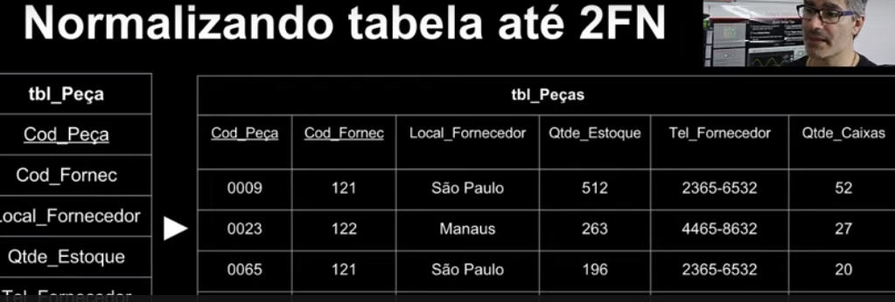
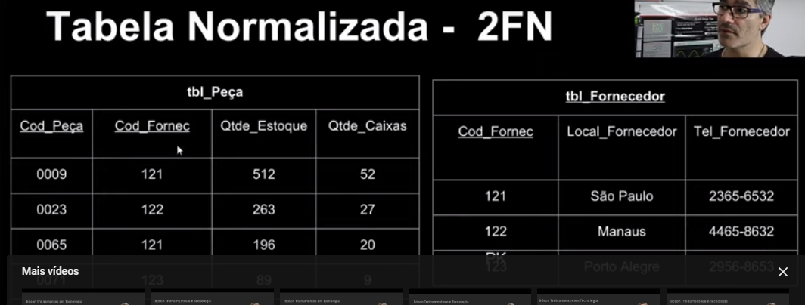
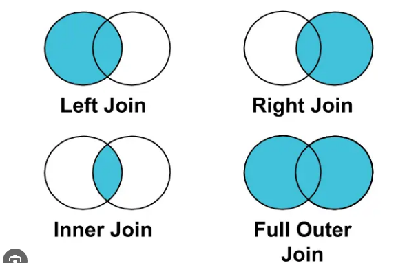

# Bancodde Dados Relacionais
Santander BootCamp: 
Instrutora: Pâmela Apolinário Borges

# Resumo de Estudos pessoais. By José Américo.

```
    # Criando um database
    CREATE DATABASE NOMEDB;
    USE NOMEDB;

```

# Introdução 

É uma coleção organizada de dados

Tipos: 
- Relacionais/SQL
- Não Relacionais / NoSQL (Not onlySQL)
- Orientado a Objetos
- Hierárquico

Um banco de dados por sí só não é auto-controlado, temos então um SGBD (Sistema Gerenciador de Banco de Dados) que possui um conjunto de ferramentas e recursos para que um Banco de Dados seja administrados.

# Funcionalidades básicas do banco relacional.

CRUD

-Create 
-Read
-Update
-Delete

Um database possui Tupla | Tuple
Linhas
Registros
Chaves estrangeiras
Chaves primárias

Tabelas são composta por linhas e colunas, onde o conjunto delas torna-se um registro.

# SQL é uma linguagem de consulta estruturada

# Banco de Dados Relacionais

# CaracterÍsticas do BD Relacional

- Relacionamento entre tabelas
- Linguagem de Consulta Estruturada
- Integridade referêncial -> Não permite deletar registros em que há um outro relacionamento
- Normalização de dados
- Segurança
- Flexibilidade e extensibilidade -> pode ser alterada 
- Suporte a Transações 

# ACID(Atomicidade, Consistência, Isolamento e Durabilidade)
ex: transações bancárias não permite duas que duas transações aconteçam em mesmo tempo evitando assim confusões de valores. 


# Conceitos básicos SQL.
SQL é um padrão de consultas em banco de dados.

DQL -> Linguagem de consulta de dados (Q) QUERY
    -> SELECT
DML -> Linguagem de Manipulaçõa de dados (M) MANIPULATION
    -> INSERT, UPDATE e DELETE
DDL -> Linguagem de Definição de dados (DDL) DATA DEFINITION
    -> CREATE, ALTER, DROP
DCL -> Linguagem de Controle de Dados (DC) DATA CONTROLS (PERMISSÕES DE ACESSO E CONTROLE)
    -> GRANT, REVOKE
DTL -> Linguagem de Transação de Dados (DT) DATA TRANSACTIONS
    -> BEGIN, COMMIT, ROLLBACK    

# Sintáxe básica de nomenclatura

- Os nomes devem começar com uma letra ou um caractere de sublinhado (_)
- Os nomes podem conter letras, números e caracteres de sublinhado
- Sensibilidade a maiúsculas ou minúsculas vai depender do tipo de banco de dados a ser utilizado.

[Referência dos conceitos](https://www.sqltutorial.org/)

# MER 
- Modelo de entidades e relacionamentos
Modelo conceitual para representar a estrutura conceitual de cada entidade

# DER

- Diagrama de entidades e relacionamentos
Representação gráfica do modelo representados por símbolos que demonstram os relacionamentos e a estrutura de um bd.

# Entidades 

As entidades são nomeadas com substantivos concretos ou abstratos que representam de forma clara sua função dentro do domínio.

Ex: usuarios, destinos, reservas etc...

# Atributos 

Os atributos são características ou propriedades das entidades. Que descrevem as informações específicas sobre uma entidade.


Ex: 

Entidade usuario tem atributos --> nome, email, senha...

Abaixo um link para poder criar alguns diagramas.
@@ Guia anónima ------>> 123
[Creately](https://creately.com/pt/home/)

# Criamos um diagrama vazio

Criamos três entidades Usuario, Destinos e Reservas

Usuarios com id, nome, dataNascimento etc...

# Existem duas maneiras de representar os atributos em diagramas a conotação utilizaraemos então a conotação tradicional elipse, porém o diagrama fica um pouco poluido visualmente

# Relacionamentos 

1..1 (um para um) --> uma instância de uma entidade pode estar relacionado no máximo a uma instância de uma outra entidade 

1..n ou 1..* (um para muitos) uma instância de entidade pode estar relacionada a uma ou muitas instâncias de uma outra entidade

n..n ou *..* (muitos para muitos) muitas instâncias de uma entidade podem estar relacionadas a muitas instâncias de uma outra entidade.

No exemplo de usuário e reserva temos que:

A cardinalidade de usuarios para reservas é 1..n, porém a cardinalidade de reservas para usuários é 1..1.

             Um [usuário] 1..1 ______<realiza>______0..n [reservas]

             Nenhuma ou mais [reservas]0..n______<vicula>______ 1..1 [destino]

[Interessante](https://www.quickdatabasediagrams.com/) Denenhando projetos on-line.

Configuração do cloudclusters
Criar um usuário
adm
permission --super
senha padrão --> Mariadb


As tabelas servem para organizar os dados
As colunas representam atributos de acordo com o tipo de dado que é definido no momento da criação (DDL).
Os registros são as informações aramazenadas nas linhas dessa tabela.

# COMANDOS DDL

CREATE TABLE {{NOMETABELA}} 
    (
        {{COLUNA}} {{TIPO}} COMMENT
        {{'COMENTARIO'}}


    );

# TIPOS PODEM VARIAR DEPENDENDO DO SGBD

INTEGER | DECIMAL | NUMERIC | CHARACTER | VARCHAR | DATA | BOOLEAN | TEXT
OPÇÕES RESTRIÇÕES DE VALORES 
NOT NULL| UNIQUE | DEFAULT
PRIMARY KEY | FOREIGN KEY | AUTO_INCREMENT

[PhpMyAdmin](https://phpmyadmin-c013.cloudclusters.net/index.php)

SCRIPTS
```

CREATE TABLE usuarioas (
    id INT,
    nome VARCHAR(255) NOT NULL COMMENT 'Nome do usuário',
    email VARCHAR(100) UNIQUE NOT NULL COMMENT 'Email do usuário',
    data_nascimento DATE NOT NULL COMMENT 'Data de nascimento do usuário',
    endereco VARCHAR(255) NOT NULL COMMENT 'Endereço do usuário'

);

CREATE TABLE viagens.destinos (
    id INT,
    nome VARCHAR(255) NOT NULL UNIQUE COMMENT 'Nome do destino',
    descricao VARCHAR(255) NOT NULL COMMENT 'Descricao do destino'
        
);

CREATE TABLE viagens.reservas (
 id INT COMMENT 'Identificador único da reserva',
 id_usuario INT COMMENT 'Referência ao ID usuário que faz a reserva',
 id_destino INT COMMENT 'Referência ao ID destino na reserva',
 data DATE  COMMENT 'Data da reserva',
 status VARCHAR(255) DEFAULT 'pendente' COMMENT 'Status da reserva (confirmada, pendente, cancelada, etc...)'


);

```
# DML(S)

# INSERT

```
insert into USUARIOS (id,nome,email,data_nascimento,endereco) 
values (1,'JOÃO PEDRO','jp@gmail.com','2019-11-25','XV DE NOVEMBRO, 5000 ASSIS/SP');

insert into USUARIOS (id,nome,email,data_nascimento,endereco) 
values (2,'JUNIHO','jr@gmail.com','2000-11-25','XV DE NOVEMBRO, 5000 ASSIS/SP');

insert into USUARIOS (id,nome,email,data_nascimento,endereco) 
values (3,'SEBASTIÃO','sb@gmail.com','1998-11-25','XV DE NOVEMBRO, 5000 ASSIS/SP');

insert into destinos (id,nome, descricao) 
values 
(1,"Praia do Tenôrio de Ubatuba","Maravilhosa praia para suas férias");

insert into destinos (id,nome, descricao) 
values 
(3,"Praia Asturias","Maravilhosa praia para suas férias"),
(4,"Praia deserta","Maravilhosa praia para suas férias");


insert into reservas (id,id_destino,id_usuario,status,data) values (1,1,1,'pendente','2023-09-28');

insert into reservas (id,id_destino,id_usuario,status,data) values (2,1,2,'concluido','2023-09-28');

insert into reservas (id,id_destino,id_usuario,status,data) values (3,2,2,'concluido','2023-09-28');

insert into reservas (id,id_destino,id_usuario,status,data) values (4,2,3,'concluido','2023-09-28');

```

# SELECT 

Observação com o Like pegamos também padrões exemplo sem precisar clausula where select *from reservas where status like 'concluido';
```
    # SELECT *FROM USUARIOS;
    # SELECT *FROM USUARIOS ORDER BY nome;
    # SELECT *FROM USUARIOS WHERE id = 1;
    # SELECT *FROM USUARIOS WHERE data_nascimento between '2019-11-25' and '2023-09-28';

```

# UPDATE

```
    UPDATE USUARIOS SET NOME = 'SEBASTIAO DA SILVA' WHERE USUARIOS.ID = 3;
    UPDATE USUARIOS SET NOME = 'SEBASTIAO DA SILVA', email ='sbsilva@gmail.com' WHERE USUARIOS.ID = 3;


```

# DELETE 

```
    DELETE FROM USUARIOS WHERE ID =2;
```

A clausula where funciona com um filtro para a consulta seguida das (condições)

# ALTERANDO AS TABELAS PARA CORRIGIR A FALTA DE RELACIONAMENTOS
# COMANDOS DDL

```
    # Alterando nome da tabela
   
    ALTER TABLE usuarioas_nova RENAME usuarios; 

    # Alterando coluna de uma tabela

    ALTER TABLE usuarios MODIFY COLUMN endereco VARCHAR(150);

```

# RECRIANDO UMA TABELA PARA MIGRAR DADOS DE UMA TABELA A SER ALTERADA.

```
CREATE TABLE usuarioas_nova (
    id INT,
    nome VARCHAR(255) NOT NULL COMMENT 'Nome do usuário',
    email VARCHAR(100) UNIQUE NOT NULL COMMENT 'Email do usuário',
    data_nascimento DATE NOT NULL COMMENT 'Data de nascimento do usuário',
    endereco VARCHAR(255) NOT NULL COMMENT 'Endereço do usuário'

);

# Migrando os dados de uma table utilizando um DUMP, porem vamos fazer de outra # forma.

# Migrando os dados

INSERT INTO usuarios_nova (id,nome,email,endereco,data_nascimento)
SELECT id,nome,email,endereco,data_nascimento from usuarios;


drop table usuarios;


```

# EXLUINDO TABELAS

```
  DROP TABLE NOMETABELA  

```

# CHAVES PRIMARIAS E ESTRANGEIRAS
ATRIBUTO OU CONJUNTO DE ATRIBUTOS QUE IDENTIFICAM DE FORMA EXCLUSIVA CADA REGISTRO DE NOSSAS TABELAS.

# PRIMARY KEY

A CHAVE PRIMARIA:IDENTIFICAÇÃO EXCLUSIVA.
Cada tabela pode possuir apenas uma chave primaria.

 É RESPONSÁVEL POR GARANTIR A INTEGRIDADE DE NOSSOS DADOS, IMPEDINDO A CRIAÇÃO DE REGISTROS DUPLICADOS E TAMBÉM A RECUPERAR OS REGISTROS.

 A chave primária (PRIMARY KEY) Pode definida durante a criação das tabelas

 ```
  CREATE TABLE MINHATABELA (
    id INTEGER NOT NULL PRIMARY KEY AUTOINCREMENT,
    #DEMAIS ATRIBUTOS 
  );
 
 
 ``` 

 # PODEMOS ADICIONAR TAMBÉM APÓS A CRIAÇÃO DAS TABELAS
 # AUTOINCREMENT ATRIBUI AUTOMATICAMENTE VALORES QUANDO FAZEMOS UM ISERT.

 ```
    ALTER TABLE MINHATABELA 
    MODIFY COLUMN ID INT PRIMARY KEY;
 
 ```

# NULL 
O campo não pode ser nulo

# FOREIGN KEY

A chave estrangeira é utilizada para manter a integridade dos dados entre as tabelas pode ser nula 
é possível ter mais de uma ou nenhuma em cada tabela.

Pode ser cridada durante a criação da tabela

```
    CREATE TABLE MINHATABELA(
        ID INT PRIMARY KEY,
        ID_OUTRATABELA INT,
        FOREIGN KEY (ID_OUTRATABELA) REFERENCES OUTRATABELA (ID)
    );

```

Ou alterar uma tabela já criada adicionando a constraint foreign key

```
    ALTER TABLE MINHATABELA
                    #nome da constraint
    ADD CONSTRAINT MINHATABELA_OUTRATABELA_FK 
    FOREIGN KEY (ID)
    REFERENCES OUTRATABELA(ID)

```

# Restrições de FK

ON DELETE --> Especifíca o que acontece com os registros pendentes quando um registro pai é excluido.


ON UPDATE --> Define o comportamento dos registros dependente quando o registro pai é atualizado

CASCADE, SET NULL, SET DEFAULT E RESTRICT -->

CASCADE     --> REPLICA A ALTERAÇÃO DO PAI NOS FILHOS
SET NULL    --> REMOVE A INTEGRIDADE REFERÊNCIAL 
SET DEFAULT --> SETA UM VALOR DEFAULT PARA OS REGISTROS QUE FICARAM SEM UM PAI
RESTRICT    --> IMPEDE QUE OCORRA A EXCLUSÃO OU ATUALIZAÇÃO DE UM REGISTRO DA TABELA PAI, CASO AINDA HAJAM REGISTROS NA TABELA FILHA. 


# ALTERANDO NOSSAS TABELAS CRIADAS USUARIOS, RESERVAS E DESTINOS

```
    # ADICIONANDO PK EM USUARIOS

       ALTER TABLE usuarios 
       MODIFY COLUMN id INT AUTO_INCREMENT,
       ADD PRIMARY KEY (id);

       ALTER TABLE destinos 
       MODIFY COLUMN id INT AUTO_INCREMENT,
       ADD PRIMARY KEY (id);

       ALTER TABLE reservas 
       MODIFY COLUMN id INT AUTO_INCREMENT,
       ADD PRIMARY KEY (id);

       ALTER TABLE reservas ADD CONSTRAINT fk_usuarios FOREIGN KEY (id_usuario) REFERENCES usuarios (id) ;

        ALTER TABLE reservas ADD CONSTRAINT fk_destinos FOREIGN KEY (id_destino) REFERENCES usuarios (id) 
        ON DELETE CASCADE 

        # TOMAR CUIDADO COM O ON DELETE CASCADE.
       
       
       usuario (id),
       ADD CONSTRAINT reservas_destino_fk foreign key (id_destino) destino(id);

       
```


# NORMALIZAÇÃO DE DADOS 

A normalização de dados é um prcesso no qual organizamos a estrutura de um banco de dados relacional de maneira a eliminar redundâncias e anomalias, garantindo a concistência e integridade dos dados.

No exemplo em nossa tabela de usuários vimos que o endereço ficou um campo de texto livre, isso não garante a padronização desses dados e ficaria difícil extrair informações tais como bairro, cidade endereço etc..

# A NORMALIZAÇÃO DE DADOS DEVERÁ OCORRER DURANTE A MODELAGEM DO BANCO DE DADOS OU SEJA DEVE SER MINUNCIOSAMENTE OBSERVADO E CALCULADO PARA GARANTIR QUE NOSSO BANCO DE DADOS FUNCIONE DE MANEIRA SUSTENTAVEL.

# FORMAS NORMAIS (1FN:)

A Primeira forma normal 

1FN: ATOMICIDADE DE DADOS

Estabelece sobre a atomicidade de dados que cada valor em uma tabela deve ser indivisível. Nenhum capo deve conter multiplos valores ou listas. 
No caso do endereço de nossos usuarios isso ocorreu com clareza

O ideal seria criar uma tabela para endereço ou criar camos separados para cada informação. 

Existem várias normas essa 1FN é uma delas: 

Estudar as FORMAS NORMAIS...

```
    ALTER TABLE usuarios 
    ADD rua VARCHAR(100),
    ADD numero VARCHAR(10),
    ADD CIDADE VARCHAR(50),
    ADD ESTADO VARCHAR(20);

    # Faz um substring na coluna endereço 
    ex: Rua Xv de Novembro, 500, Assis/SP pegando cada valor após a vírgula.

    UPDATE usuarios
    SET rua = SUBSTRING_INDEX(SUBSTRING_INDEX(endereco,',',1),',',-1),
    numero =  SUBSTRING_INDEX(SUBSTRING_INDEX(endereco,',',2),',',-1),
    cidade =  SUBSTRING_INDEX(SUBSTRING_INDEX(endereco,',',3),',',-1),
    estado = SUBSTRING_INDEX
    (endereco,',',-1);

    ALTER TABLE usuarios
    DROP COLUMN endereco;
```
# SEGUNDA FORMA NORMAL (2FN:)

2FN: 
Para poder aplicar a segunda froma normal, temos como pré requisito a 1FN já implementada.

Todos os atributos não chave devem depender totalmente da chave primária.

# Se sua tabela tem uma chave primária simples não existe a possibilidade de termos depêndencia parcial e por tanto ela já está na 2FN.

"Segunda Forma Normal (2FN):

Uma tabela encontra-se na segunda forma normal se ela atende todos os requisitos da primeira forma normal e se os registros na tabela, que não são chaves, dependam da chave primária em sua totalidade e não apenas parte dela.20 de dez. de 2022"

[fonte](https://www.google.com/search?q=2+forma+normal+banco+de+dados&oq=2+FORMA+NORMAL+B&gs_lcrp=EgZjaHJvbWUqBwgAEAAYgAQyBwgAEAAYgAQyBggBEEUYOTIKCAIQABgKGBYYHtIBCDUyMzhqMGo0qAIAsAIA&sourceid=chrome&ie=UTF-8)


Como testar a 2FN 

Expandir a tabela preencher e observar alguns dados, 



Verificar coluna por coluna local_fornecedor depende do código do fornecedor
Qtde_estoque depende do código da peça
só do código da peça ou do forncedor?
tel_forncedor depende do código da peça?
qtde_caixas depende da qtde_estoque

# Tabela normalizada ex:



Retiramos os atributos que não dependem da pk da tabela peças

e colocamos em outra tabela tbl_fornecedor

A quantidade de caixas poderiam ser eliminadas e fazer um campo calculado

Elimanmos então as depêndencias parciais.

# TERCEIRA FORMA NORMAL (3FN:)

Uma tabela tem que estar de acordo com a 2FN.
Nenhuma coluna não chave depender de outra coluna não chave

Ex: Relação de Estado -> Cidade

Todos atributos devem depender somente do id

É preciso ter um bom senso na hora de normalizar as nossas tabelas caso a cidade e estado fossem de extrema importância para a aplicação seria cabibel aplicar a terceira forma normal, porém em nossos exemplos para manter a simplicidade, não foi necessário aplicar.

Resumo 

1FN --> GARANTE QUE CADA VALOR SEJA ATÔMICO E QUE OS REGISTROS SEJAM ÚNICOS

2FN --> GARANTE QUE OS ATRIBUTOS NÃO CHAVE DEPENDAM TOTALMENTE DA CHAVE PRIMÁRIA

3FN --> ELIMINA DEPENDÊNCIAS TRANSITIVAS ENTRE OS ATRIBUTOS NÃO CHAVE, GARANTINDO QUE CADA ATRIBUTO NÃO CHAVE DEPENDA APENAS DA CHAVE PRIMÁRIA, NÃO HAVENDO DEPENDENCIAS INDIRETAS ENTRE ELAS.

# INNER JOIN
Retorna apenas as linhas que têm correspondência em ambas as tabelas envolvidas na junção. A Junção é feita com base em uma condição de igualdade especificada na cláusula ON.

```
    SELECT *FROM TABELA1
    INNER JOIN TABELA2 ON TABELA1.COLUNA = TABELA2.COLUNA;

    # NO EXEMPLO DU USUÁRIO
    # SE ELE TIVER UMA RESERVA VAI RETORNAR CASO CONTRÁRIO NÃO RETORNARÁ.

    SELECT *FROM usuarios 
    INNER JOIN reservas ON usuarios.id = usuarios.id;

    # UTILIZANDO ALIAS PARA ENCURTAR OS NOMES

    SELECT *FROM usuarios us
    INNER JOIN reservas rs ON us.id = rs.id_usuario
    INNER JOIN destinos ds ON rs.id_destino = ds.id;

    SELECT *FROM usuarios us
    LEFT JOIN reservas rs ON us.id = rs.id_usuario


```



INNER JOIN --> DADOS COMUNS ENTRE AS TABELAS


# LEFT JOIN AGREGA TODAS AS INFOMAÇÕES

Retorna todas as tabelas da esquerda e todas as que encontrar da direita, caso não sejam todos relacionados retorna alguns campos null(s).

# RIGHT JOIN

Retorna todas as tabelas da direita e todas que encontrar da esquerda. O contrário do LEFT JOIN.

INSERT INTO DESTINOS (NOME,DESCRICAO) VALUES("DESTINO SEM RESERVA","descricao");

```
    SELECT *FROM reservas rs 
    RIGHT JOIN destinos ds 
    ON rs.id = ds.id_reserva; 
```


# FULL JOIN

Retorna todas as linhas de ambas as tabelas envolvidas na junção, combinando-as com base em uma condição de igualdade. Se não houver correspondência, os valores ausentes serão null

```
    SELECT 
    *FROM usuarios us
    FULL JOIN reservas rs ON rs.id_usuario = us.id;
```

# SUB CONSULTAS

Permitem realizar consultas mais complexa que voê use o resultado como entrada para outra consulta.

UTILIZADA EM 

SELECT, FROM, WHERE, HAVING E JOIN.

```
    # Buscando os destinos sem reservas utilizando uma sub consulta.

    SELECT *FROM destinos where id NOT IN (SELECT id_destino FROM reservas );
    
    # Buscando os usuarios sem reservas utilizando uma sub consulta.

    SELECT *FROM usuarios where id NOT IN (SELECT id_usuario FROM reservas );

    SELECT nome, (SELECT COUNT(*) FROM reservas WHERE id_usuario = usuarios.id) as total_reservas FROM usuarios;

```
# FUNÇÕES AGREAGADAS OU AGREGADORAS

COUNT -> CONTA OS NÚMEROS DE REGISTROS

SUM   -> SOMA OS VALORES DE UMA COLUNA NUMÉRICA

AVG   -> CALCULA MÉDIA DOS VALORES DE UMA COLUNA NUMÉRICA

MIN   -> RETORNA O VALOR MÍNIMO DE UMA COLUNA (PODE SER DATA)

MAX   -> RETORNA O VALOR MÁXIMO DE UMA COLUNA (PODE SER DATA)


```
   SELECT COUNT(*) usuarios

                    #alias nomeando a coluna do resultado                                
   SELECT COUNT(*) as total_usuarios FROM usuarios;

    #ou utilizando o INNER JOIN

   # Todos os usuários que estão relacionados com reservas utilizando INNER JOIN ON 
   SELECT COUNT(*) as total_usuarios FROM usuarios us INNER JOIN reservas rs ON us.id = rs.id_usuario

   # Pegando a maior idade
   SELECT MAX(TIMESTAMPDIFF(YEAR,data_nascimento,CURRENT_DATE())) as maior_idade FROM usuarios;

   # AGRUPAMENTOS DE CONSULTAS

   SELECT *FROM RESERVAS;
   # Para visualizar o teste adicionaremos mais de um destino para um mesmo usuário com destinos diferentes.

   INSERT INTO reservas (data,id_destino,id_usuario,status) VALUES(CURRENT_DATE,4,1,'agendado');

   # Queremos saber quantas reservas para cada destino
   
   # AGRUPANDO RESULTADOS
   SELECT COUNT(*) FROM reservas GROUP BY id_destino;

    # AGRUPANDO RESULTADOS
   SELECT COUNT(*), id_destino FROM reservas GROUP BY id_destino;

    # ORDENAÇÃO DE RESULTADOS

    SELECT *FROM usuarios ORDER BY nome;

    # ORDENANDO DE FORMA ASCENDENTE 

    SELECT COUNT(*) AS qtd_reserva, id_destino FROM reservas GROUP BY id_destino;
    
    # AGRUPANDO E ORDENANDO RESULTADOS
    # POR PADRÃO PEGA ORDEM ASCENDENTE

    SELECT COUNT(*) AS qtd_reserva, id_destino FROM reservas GROUP BY id_destino ORDER BY qtd_reserva;

    UTILIZANDO O DESC PEGA A ORDEM DESCENDENTE

    SELECT COUNT(*) AS qtd_reserva, id_destino FROM reservas GROUP BY id_destino ORDER BY qtd_reserva DESC;
     
     # ORENANDO MAIS DE UMA COLUNA RETORNA RESULTADO NA ORDEM DA PASSAGEM DAS VARIÁVEIS
     SELECT COUNT(*) AS qtd_reserva, id_destino FROM reservas GROUP BY 
     id_destino ORDER BY qtd_reserva DESC, id_destino DESC;
                            #variável       # variável


```

# ÍNDICES

Consultas avançadas - índices de busca

# Análise de Plano de Execução.

Permite examinar as operações realizadas, as tabelas acessadas, os índices utilizados e outras informações importantes para identificar possíveis melhorias de desempenho.

EXPLAIN 
    SELECT *
    FROM TABELA

select_type: "SIMPLE", "SUBQUERY", "JOIN", table.

type: "ALL", "INDEX" entre outros 

possíble_keys: Os índices possíves que podem ser utilizados na operação.

key: O índice utilizado na operação, se aplicável

key_len: O comprimento do índice utilizado

ref: As colunas ou constantes usadas para acessar o índice 
rows 

Exemplos:

```
    
     EXPLAIN SELECT *FROM usuarios where email ="ZE@ZE";

    # Criando um índice para otimização de consultas aumentando a performance.
    
    # Simples ou composta de acordo com a quantidade de parâmetros.
     CREATE INDEX idx_nome ON usuarios (nome);

     EXPLAIN SELECT *FROM usuarios where email ="ZE@ZE";


```


